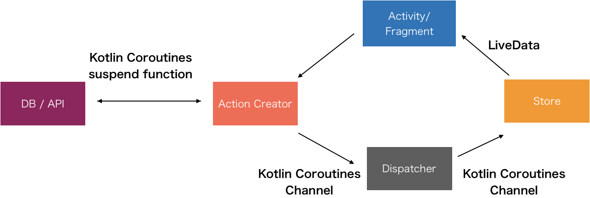

# DroidKaigi 2019 official Android app[WIP]

[DroidKaigi 2019](https://droidkaigi.jp/2019/en/) is a conference tailored for developers on 8th and 9th February 2019.

[](https://dply.me/b9riom#install)


# Features

| top | filter |
|---|---|
|  |  |

* View conference schedule and details of each session
* Set notification for upcoming sessions on your preference
* Search sessions and speakers and topics
* Show Information Feed

# Contributing
We are always welcome your contribution!

## How to find the tasks
We use [waffle.io](https://waffle.io/DroidKaigi/conference-app-2019) to manage the tasks.
Please find the issues you'd like to contribute in it.
[welcome contribute](https://github.com/DroidKaigi/conference-app-2019/labels/welcome%20contribute) and [easy](https://github.com/DroidKaigi/conference-app-2019/labels/easy) are good for first contribution.

Of course, it would be great to send PullRequest which has no issue!

## How to contribute
If you find the tasks you want to contribute, please comment in the issue like [this](https://github.com/DroidKaigi/conference-app-2018/issues/73#issuecomment-357410022) to prevent to conflict contribution.
We'll reply as soon as possible, but it's unnecessary to wait for our reaction. It's okay to start contribution and send PullRequest!

We've designated these issues as good candidates for easy contribution. You can always fork the repository and send a pull request (on a branch other than `master`).

# Development Environment

## Kotlin
This app is full Kotlin!

## Multi Module Project
Green: Android Module  
Red: Kotlin Module  
Gray: Common Module

Dashed line: implementation  
Normal line: api


# Architecture

Unidirectional data flow(Flux-based) Architecture with Kotlin Coroutines and AndroidX Libraries(LiveData, ViewModel, Room) DataBinding, dependency injection, Firebase etc.





## Activity/Fragment -> Action Creator


Fragments just call Action Creator's method.

```kotlin
class SessionPagesFragment : DaggerFragment() {
    override fun onActivityCreated(savedInstanceState: Bundle?) {
    ...
      sessionPagesActionCreator.load()
    }
```

## Action Creator <-> DB / API and Action Creator -> dispatcher


Action Creator fetches data from DB / API with `Kotlin Coroutines suspend function`. And Action Creator dispatches data loaded action and loading state changed actions. 

```kotlin
class SessionPagesActionCreator @Inject constructor(
    override val dispatcher: Dispatcher,
    private val sessionRepository: SessionRepository,
    private val lifecycle: Lifecycle
) : CoroutineScope by lifecycle.coroutineScope, // Implement CoroutineScope for lifecycle handling
    ErrorHandler {
    fun load() { // This method is called by Fragment
        launch {
            try {
                // dispatch loading state changed events
                dispatcher.dispatchLoadingState(LoadingState.LOADING)
                // data from DB / API with Kotlin Coroutines suspend function
                val sessionContents = sessionRepository.sessionContents() 
                // dispatch data loaded events
                dispatcher.dispatch(Action.SessionsLoaded(sessionContents))
            } catch (e: Exception) {
                onError(e)
            } finally {
                dispatcher.dispatchLoadingState(LoadingState.FINISHED)
            }
        }
    }
    
    private suspend fun Dispatcher.dispatchLoadingState(loadingState: LoadingState) {
        dispatch(Action.SessionLoadingStateChanged(loadingState))
    }
```

Actions are just data holder class.

```kotlin
sealed class Action {
    data class SessionLoadingStateChanged(val loadingState: LoadingState) : Action()
    data class SessionsLoaded(
        val sessionContents: SessionContents
    ) : Action()
```

## Dispatcher -> Store


Store subscribe dispatcher's action with `Kotlin Coroutines channel` and transform it to AndroidX `LiveData`.
This store is a `ViewModel`. But if the store is used by whole application(ex: UserStore), you can change the store to a singleton.

```kotlin
class SessionPagesStore @Inject constructor(
    dispatcher: Dispatcher
) : ViewModel() {
    val loadingState = dispatcher
        .subscribe<Action.SessionLoadingStateChanged>()
        .map { it.loadingState }
        .toLiveData(LoadingState.LOADING)
    val isLoading
        get() = loadingState.value == LoadingState.LOADING

    val sessionContents = dispatcher
        .subscribe<Action.SessionsLoaded>()
        .map { it.sessionContents }
        .toLiveData(SessionContents.EMPTY)
```

## Store -> Activity/Fragment


In fragment, we can observe Store's `LiveData`. You can display the UI with `LiveData`.

```kotlin
    override fun onActivityCreated(savedInstanceState: Bundle?) {
        sessionPagesStore.sessionContents.changed(this) { sessionContents ->
            // we can show UI with sessionContents
        }
```
